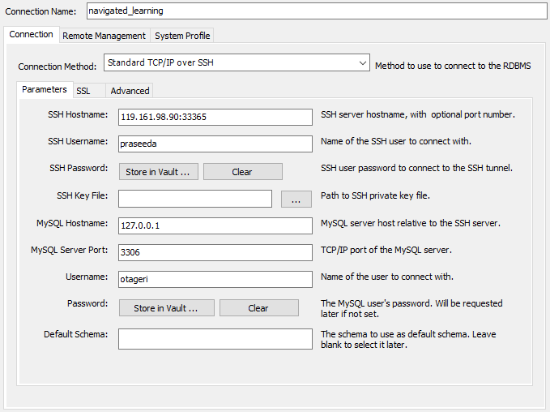

# frontend:  
```
cd frontend
# install dependencies
npm install
# run react app:
npm start
```

# backend:  
## for database setup:
- install mysql
- add user `otageri` with password `784512963` (give database read/write permissions at least)
- can install mysql workbench for easy to use gui
- (optional) add server database instance to workbench
    - open mysql workbench and add new connection with the following config:  
      
    - ssh password is `Pr@seed@`
    - mysql password is `784512963`
## for running backend:
- install python v3.11 or later
- make sure mysql instance is running on port 3306 with mentioned username and password
- for linux:
```
cd Backend
# create the venv:
python3 -m venv .venv
# activate the venv:
./.venv/bin/activate # or similar
# install requirements:
python3 -m pip install -r requirements.txt # or similar
# run app:
python3 app.py
```
- for windows:
```
cd Backend
# create the venv:
python -m venv .venv
# activate the venv:
.\.venv\Scripts\Activate.ps1 # or activate.bat
# install requirements:
pip install -r requirements.txt
# run app:
python app.py
```
